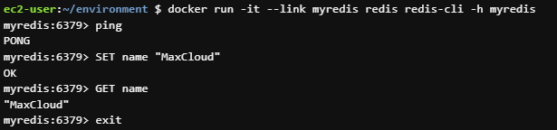

# Trabajando con redes

La red de contenedores se refiere a la capacidad de los contenedores de conectarse y comunicarse entre sí o con cargas de trabajo que no sean de Docker.

## Principales comandos

Para poder trabajar con las rededs utilizaremos el comando docker de la siguiente forma "docker network [comando]"

#### docker network ls

El siguiente comando mostrará todas las redes

```sh
$ docker network ls
```

#### docker network create

Para crear una red usamos el siguiente comando

```sh
docker network create -d [DRIVER] [NAME]
```

Ejemplo:

```sh
docker network create -d bridge my-network
```

#### docker network rm

Para eliminar una red usamos el siguiente comando

```sh
docker network rm [NAME]
```

Ejemplo: 

```sh
docker network rm my-network
```

#### docker network inspect

Para inspeccionar una red usamos el comando

```sh
docker network inspect [NAME]
```

# Trabajando con redes bridge

Creamos una red con el driver bridge

```sh
docker network create demo-network -d bridge
```

Arrancamos un contenedor conectado a la nueva red

```sh
docker run --name container1 -d --network demo-network nginx
```

A continuacion arrancamos un segundo container con el siguiente comando

```sh
docker run --name container2 -d nginx
```

ingresamos al segundo contenedor con el siguiente comando

```sh
docker exec -it container2 bash
```

una vez dentro del contenedor usamos el comando curl para verificar la conexion con el primer contenedor

```sh
curl container1:80
```

verificamos que el comando falla, salimos del contenedor presionando ctrl + c

a continuación conectamos el segundo contenedor a la red

```sh
docker network connect demo-network container2
```

volvemos a ingresar al contenedor

```sh
docker exec -it container2 bash
```

lanzamos el comando curl y verificamos que podemos conectarnos al primer contenedor

```sh
curl container1:80
```

# Trabajando con redes host

El driver host permite enlazar un contenedor directamente con el host

Lanzamos un contenedor con el driver host

```sh
docker run -d --name nginx --network host nginx:latest
```

Ingresamos al contenedor

```sh
docker exec -it nginx bash
```

Ahora verificamos que el contenedor se enlace con el host, lanzamos el comando curl en el host

```sh
curl localhost:80
```

# Trabajando con redes none

Con el driver none aislamos un contenedor

Lanzamos un contenedor con el driver none

```sh
docker run -d --name nginx --network none nginx:latest
```

Ingresamos al contenedor

```sh
docker exec -it nginx bash
```

Verificamos que no podemos conectarnos a ninguna pagina externa 

```sh
curl www.google.com
```

# Enlazando contenedores

Cuando trabajas con contenedores muchas veces vas a querer que exista una comunicación entre estos, para esto se utiliza el comando run mas la bandera --link

#### docker run --link

A continuación se va mostrar un ejemplo del uso de la bandera link para poder enlazar dos contenedores

1 Vamos a lanzar un contenedor corriendo redis

```sh
docker run -d --name myredis redis
```

2 Vamos a lanzar otro contenedor redis pero que utilize el redis-cli para poder contectarse al primero.

```sh
docker run -it --link myredis redis redis-cli -h myredis
```

Para enlazar el segundo contenedor con el primero vamos a utilizar la bandera --link y luego colocar el nombre del primer contenedor "myredis".
Despues de colocar la imagen redis, vamos a colocar el comando "redis-cli -h myredis" donde le decimos al contenedor que utilize el redis-cli y se contecte al host (-h) "myredis"

Una vez iniciado el container vamos a lanzar los comandos mostrados en la imagen para interactuar con redis

<p align="center">

</p>
